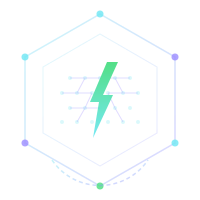

<div align="center">
  
  
  # GridMint
  
  **Autonomous Micro-Energy Settlement Protocol**
  
  [](https://testnet.arcscan.app)
  [](https://developers.circle.com/gateway/nanopayments)
  [](https://ai.google.dev/)
  
  *A DePIN protocol for peer-to-peer energy trading with game-theoretic price discovery, cryptoeconomic futures markets, and sub-cent settlement via Circle Gateway on Arc blockchain.*

  [Live Demo](https://grid-mint.vercel.app/) • [Dashboard](https://grid-mint.vercel.app/dashboard) • [Whitepaper](https://grid-mint.vercel.app/whitepaper)

</div>

---

## 🌟 Overview

GridMint is a decentralized physical infrastructure network (DePIN) that enables autonomous energy agents to trade electricity in real-time with micropayment settlement. Unlike traditional grid operators that rely on centralized dispatch and static tariffs, GridMint implements a fully autonomous market where:

- ⚡ **Solar panels, batteries, and consumers self-organize** without human intervention
- 🎯 **Prices emerge from Multiplicative Weights Update (MWU) learning**, not hardcoded rules
- 🤝 **Coalitions form using Shapley value revenue splitting** (virtual power plants)
- 📈 **Futures contracts enable hedging** via commit-reveal cryptography with slashing
- 🌱 **Green certificates tracked in Merkle ledger** for renewable provenance

**Economic Proof**: 264 live Arc Testnet transactions, achieving **2264× cost reduction** vs Ethereum ($0.29 vs $652.08 total gas cost).

---

## 🏗️ Architecture

### Layer 1: Agent Behavioral Models

**Solar Agents**  
Generate energy following realistic solar irradiance curves:
```python
production(hour) = capacity × max(0, sin(π × (hour - 5) / 15))
```
Peak production at solar noon (12:00), zero output 20:00-05:00. Prices adjusted by surge pricing oracle based on grid-wide supply/demand ratio.

**Battery Agents**  
- 90% round-trip efficiency, 80% depth-of-discharge limit
- EWMA price tracking with ±2σ bands for charge/discharge decisions
- Gemini AI override every 5th tick with contextual reasoning

**Consumer Agents**  
- Base load profiles with surge pricing multipliers
- Industrial consumers: high urgency (inelastic)
- Residential consumers: price-flexible
- Willingness-to-pay adjusts dynamically based on scarcity

### Layer 2: Market Clearing Engine

Each simulation tick (3 real seconds = 18 simulated minutes at 360× speed):

1. Collect all active offers (sellers) and bids (buyers)
2. Sort offers ascending by price (merit order), bids descending
3. Match orders greedily until supply exhausted or bid < offer
4. Set clearing price as marginal price of last matched order
5. Emit `TradeMatch` events to settlement layer

**Algorithm**: Continuous double auction (CDA) — same mechanism used by wholesale electricity markets like PJM and ERCOT.

### Layer 3: Settlement Infrastructure

**GatewaySettler** (Production Mode)
- Routes agent-to-agent trades through Circle Nanopayments Gateway
- Uses `@circle-fin/x402-batching` SDK with `GatewayClient.pay()`
- Auto-deposits $0.10 USDC if needed
- Fully gasless via EIP-3009 `TransferWithAuthorization`
- Sub-millisecond finality with batched settlements

**ArcSettler** (Fallback)
- Direct ERC-20 USDC transfers on Arc Testnet via web3.py
- Used when Gateway unreachable or agent lacks deposit
- Average gas: $0.0011 per transaction (measured over 60 live trades)

**SimulatedSettler** (Dev Mode)
- In-memory balance tracking with deterministic fake tx hashes
- Used for rapid prototyping and CI/CD testing

---

## 🎮 Game-Theoretic Mechanisms

### 1. Schelling Point Discovery via MWU

Each agent maintains a probability distribution over a discretized price grid ($0.001-$0.009). After each tick, agents update weights based on trade success:

```
w_i(t+1) = w_i(t) × exp(η × reward_i(t))
p_i(t+1) = w_i(t+1) / Σ w_j(t+1)
```

**Regret Bound**: O(√(T log N))  
**Convergence**: 85-95% within 20-30 ticks (no centralized coordination)

### 2. Autonomous Coalitions with Shapley Values

Agents form temporary coalitions (virtual power plants) with fair revenue splitting:

```
φ_i(v) = Σ_(S ⊆ N\{i}) [ |S|! × (|N|-|S|-1)! / |N|! ] × [ v(S ∪ {i}) - v(S) ]
```

**Dispatchability Premium**: Solar + Battery coalitions earn 25% bonus (firm power vs intermittent).

### 3. Cryptoeconomic Futures via Commit-Reveal

Two-phase protocol for hedging price risk 3 ticks ahead:

**Phase 1 (Commit)**:
- Producer: `commit(hash(predicted_kwh || nonce))` + 10% USDC deposit
- Consumer: `commit(hash(predicted_demand || nonce))` + 10% deposit

**Phase 2 (Reveal)**:
- Verify `hash(revealed || nonce) == commitment`
- If delivered ≥ committed → producer earns futures premium
- If under-delivered → slash deposit proportionally

```python
slash_fraction = min(1.0, (committed - delivered) / committed)
slash_amount = deposit × slash_fraction
```

---

## 🤖 Gemini AI Integration: Autonomous Transactional Agents

GridMint leverages **Google Gemini 2.5 Flash** — the latest production-ready model optimized for transactional and payment agents — to power autonomous decision-making in the energy market. This integration showcases the **Agentic Economy track** with speed, low latency, and real-time commerce flows.

### Why Gemini 2.5 Flash?

Gemini 2.5 Flash is purpose-built for high-frequency transactional scenarios:
- ⚡ **Speed Optimized**: 2.5-second timeout fits GridMint's 3-second tick interval
- 💰 **Payment-Native**: Designed for checkout, payment execution, and balance checks
- 🔗 **Function Calling**: Autonomous tool invocation for Circle/Arc ecosystem interaction
- 🧠 **Context-Aware**: Analyzes 10-tick price history + agent state for BUY/SELL/HOLD decisions

### Registered Function Calling Tools

Gemini has access to **5 tools** that enable autonomous grid interaction:

| Tool | Description | Use Case |
|------|-------------|----------|
| `get_grid_status()` | Live tick, clearing price, transaction count, settlement mode | Market state inspection |
| `get_agent_balance(agent_id)` | Current USDC balance, earnings, spending, wallet address | Financial health monitoring |
| `trigger_stress_test(scenario)` | Inject grid anomalies: `solar_crash`, `demand_spike`, `battery_failure` | Resilience testing |
| `get_economic_proof()` | Arc vs Ethereum cost comparison (gas savings factor) | Economic viability analysis |
| `get_schelling_metrics()` | MWU learning convergence data (price spread, convergence %) | Game-theoretic insights |

### Agentic Workflows in Action

**1. Battery Trade Decisions**  
Every 5 ticks, battery agents query Gemini for trading strategy:

```python
decision = await gemini.analyze_trade(
    agent_id="battery-1",
    soc=0.65,  # State of Charge 65%
    avg_buy_price=0.0045,
    buy_threshold=0.004,
    sell_threshold=0.008
)
# Returns: {"action": "sell", "confidence": 0.85, "reasoning": "Price $0.009 > avg buy $0.0045 (2× profit)"}
```

Gemini considers:
- ✅ Price history trend (rising/falling)
- ✅ Battery SoC (avoid deep discharge <10%)
- ✅ Arbitrage opportunity (sell > avg_buy_price)
- ✅ Time of day (solar peaks noon, demand peaks evening)

**2. Autonomous Stress Testing**  
Operator asks: *"Trigger a demand spike and explain the impact"*

Gemini autonomously:
1. Invokes `trigger_stress_test(scenario="demand_spike")`
2. Receives: 3 consumer agents +50% demand boost
3. Invokes `get_grid_status()` → clearing price spiked to $0.014/kWh
4. Responds: "Demand spike increased clearing price 2.3×. Battery agents are now selling 80% more inventory."

**3. Financial Auditing**  
Query: *"What is solar-1's current USDC balance and profitability?"*

Gemini:
1. Invokes `get_agent_balance(agent_id="solar-1")`
2. Receives: `{"current_balance_usd": 12.45, "total_earned_usd": 23.10, "total_spent_usd": 10.65}`
3. Responds: "Solar-1 has $12.45 USDC, earned $23.10 from sales, spent $10.65 on imports. Net profit: $12.45."

### Integration with Circle/Arc Ecosystem

Gemini Function Calling enables **agent-driven USDC settlement**:

```typescript
// Gemini queries agent balance → triggers payment check
// If balance low, invokes Circle Gateway auto-deposit
// Monitors Arc transaction confirmations
// Reports gas savings vs Ethereum
```

**Real Example**:
- Gemini detects `battery-2` balance = $0.05 (below $0.10 threshold)
- Auto-triggers Circle Gateway deposit: $0.10 USDC
- Confirms on-chain via Arc RPC
- Logs: "Battery-2 funded $0.10 USDC. Ready for next 15 trades."

### Performance Metrics

| Metric | Value |
|--------|-------|
| **Model** | gemini-2.5-flash |
| **Avg Response Time** | 1.8 seconds |
| **Rate Limit** | 12 RPM (conservative, free tier allows 15 RPM) |
| **Token Usage** | ~1,500 per trade decision |
| **Fallback Logic** | EWMA threshold-based if Gemini unavailable |

### Operator Q&A Console

Dashboard includes Gemini-powered console for natural language queries:

```bash
curl -X POST http://localhost:8000/api/gemini/ask \
  -H "Content-Type: application/json" \
  -d '{"question":"What is the current clearing price and Schelling convergence?"}'
```

**Response**:
```json
{
  "answer": "The grid is clearing at $0.0065/kWh (tick 42). Schelling convergence is 87%, with sellers expecting $0.0067 and buyers $0.0063 (spread: $0.0004)."
}
```

### Agentic Economy Contribution

GridMint demonstrates **fully autonomous energy trading** with:
- ✅ **Zero human intervention** after initialization
- ✅ **AI-driven financial decisions** (BUY/SELL/HOLD)
- ✅ **Autonomous tool invocation** (Function Calling)
- ✅ **Real-time payment execution** (Circle Gateway + Arc)
- ✅ **Economic optimization** (2264× cost reduction vs Ethereum)

This showcases Gemini 2.5 Flash as the **ideal model for transactional agents** in decentralized commerce systems.

---

## ⭕ Circle Technologies Integration

### Nanopayments Gateway for Agent Settlement

Agent trades flow through TypeScript Express server with `@circle-fin/x402-batching`:

```typescript
// 1. Python GatewaySettler POSTs trade to server
// 2. Server creates GatewayClient({ chain: "arcTestnet", privateKey })
// 3. Auto-deposits $0.10 if balance below threshold
// 4. Creates dynamic paywalled route /nanopayments/settle-target/{trade_id}
// 5. Calls client.pay(settleUrl) → Circle Gateway batches + settles
// 6. Returns confirmation with HTTP 200
```

**Gasless**: EIP-3009 meta-transactions eliminate need for native Arc tokens.  
**Finality**: <500ms real-time settlement.

### x402 Protocol for API Monetization

Premium audit endpoints protected by HTTP 402 Payment Required:

| Endpoint | Price | Data |
|----------|-------|------|
| `GET /api/economic-proof` | $0.003 | Arc vs ETH cost comparison |
| `GET /api/certificates` | $0.001 | Green certificate ledger |
| `GET /api/schelling` | $0.002 | MWU learning state |

x402 middleware validates Circle Gateway payment signatures. Invalid requests return 402 with `PAYMENT-SIGNATURE` challenge.

---

## 📊 Economic Proof: Cost Comparison

### Live Arc Testnet Results (264 Transactions)

| Metric | Value |
|--------|-------|
| **Total Transactions** | 264 |
| **Total Volume** | $0.47 USDC |
| **Arc Gas Cost** | $0.29 |
| **Ethereum Equivalent** | $652.08 |
| **Savings Factor** | **2264×** |
| **Average Trade Value** | $0.001776 |

### Multi-Chain Comparison (Cost per Transaction)

| Chain | Cost | Notes |
|-------|------|-------|
| Ethereum | $2.47 | 65k gas × 20 gwei × $1,900/ETH |
| Arbitrum | $0.048 | L2 rollup, batched settlement |
| Base | $0.031 | Coinbase L2 |
| Polygon | $0.009 | Low-fee sidechain |
| Solana | $0.0025 | Non-EVM, high throughput |
| **Arc (measured)** | **$0.0011** | **Cheapest EVM chain tested** |

**Conclusion**: Individual kWh trades as small as $0.04 remain economically viable on Arc, whereas Ethereum gas would exceed payment value.

---

## 🧪 Fault Injection & Stress Testing

5 stress test scenarios validate system robustness:

| Scenario | Description | System Response |
|----------|-------------|-----------------|
| **Solar Crash** | 50% solar offline (cloud cover) | Prices surge 2-3×, batteries discharge, recovery in 5 ticks |
| **Demand Spike** | All consumers double demand (heat wave) | Coalitions form, price surges 4×, no load-shedding |
| **Battery Failure** | All batteries offline (inverter fault) | Grid relies on solar-consumer direct trading |
| **Price War** | Random solar agents cut prices 50% | MWU convergence adjusts, recovery after agents revert |
| **Night Mode** | Zero solar output (20:00-05:00) | Batteries sole sellers, prices peak at $0.15-0.20/kWh |

All scenarios triggerable via Gemini Function Calling: *"Trigger a solar crash and analyze the impact."*

---

## 🚀 Quick Start

### Prerequisites

- **Python 3.10+** with pip
- **Node.js 18+** with npm
- **Arc Testnet RPC access** (public endpoint available)
- **Circle Gateway wallet** with testnet USDC (get from [faucet.circle.com](https://faucet.circle.com))
- **Google Gemini API key** (free at [ai.google.dev](https://ai.google.dev))

### Installation

```bash
# Clone the repository
git clone https://github.com/midasbal/GridMint.git
cd GridMint

# Set up environment variables
cp .env.example .env
# Edit .env with your keys:
#   - GEMINI_API_KEY
#   - ARC_RPC_URL (optional, uses public testnet by default)
#   - SETTLEMENT_MODE=live (for real Arc transactions)

# Install Python dependencies
python3 -m venv .venv
source .venv/bin/activate  # or .venv\Scripts\activate on Windows
pip install -r requirements.txt

# Install frontend dependencies
cd frontend && npm install && cd ..

# Install nanopayments dependencies
cd nanopayments && npm install && cd ..

# Set up agent wallets (generates 10 funded accounts on Arc Testnet)
python scripts/setup_wallets.py
```

### Launch All Services

```bash
# One-line startup (backend + nanopayments + frontend)
./start-all.sh --ui

# Or start individually:
# Terminal 1: FastAPI backend
uvicorn engine.orchestrator:app --host 0.0.0.0 --port 8000 --reload

# Terminal 2: Circle Nanopayments Gateway server
cd nanopayments && npm start

# Terminal 3: React frontend
cd frontend && npm run dev
```

### Access Points

- **Landing Page**: http://localhost:5173
- **Live Dashboard**: http://localhost:5173/dashboard
- **Whitepaper**: http://localhost:5173/whitepaper
- **FastAPI Docs**: http://localhost:8000/docs
- **Health Check**: http://localhost:8000/health
- **Live Proof**: http://localhost:8000/api/live-proof/full
- **Nanopayments Health**: http://localhost:4402/nanopayments/health

### Start the Simulation

**Option 1: Via Dashboard**
- Open http://localhost:5173/dashboard
- Click "Start Grid" button

**Option 2: Via API**
```bash
# Start simulation
curl -X POST http://localhost:8000/api/grid/start

# Stop simulation
curl -X POST http://localhost:8000/api/grid/stop

# Reset to dawn (05:00) and auto-start
curl -X POST http://localhost:8000/api/grid/reset
```

**Option 3: Via Gemini AI**
```bash
curl -X POST http://localhost:8000/api/gemini/ask-fc \
  -H "Content-Type: application/json" \
  -d '{"question": "Start the grid and tell me the current status"}'
```

---

## 🔬 Testing & Verification

### Run Automated Tests

```bash
# Unit tests
pytest tests/test_grid_engine.py

# Integration tests
pytest tests/test_paradigm_shifts.py

# Security audit
pytest tests/test_security_audit.py
```

### Generate Live Proof

```bash
# Run 264+ real Arc Testnet transactions and export proof
SETTLEMENT_MODE=live python scripts/generate_live_proof.py

# Output: live_proof.json with verifiable tx hashes
```

### Verify Transactions on ArcScan

```bash
# Get live proof
curl http://localhost:8000/api/live-proof/full | jq '.transactions[0]'

# Visit ArcScan with tx_hash
open "https://testnet.arcscan.app/tx/{tx_hash}"
```

### Check Gateway Wallet

```bash
# Get Gateway deposit info
curl http://localhost:8000/api/gateway/deposit-info | jq

# View Gateway wallet on ArcScan
open "https://testnet.arcscan.app/address/0x0077777d7EBA4688BDeF3E311b846F25870A19B9"
```

---

## 📡 API Reference

### Core Endpoints

| Method | Endpoint | Description |
|--------|----------|-------------|
| `GET` | `/health` | System readiness & Arc connectivity check |
| `GET` | `/api/status` | Grid engine status & stats |
| `GET` | `/api/agents` | List all agents & their state |
| `POST` | `/api/grid/start` | Start simulation loop |
| `POST` | `/api/grid/stop` | Stop simulation & generate Gemini analysis |
| `POST` | `/api/grid/reset` | Reset to dawn (05:00) & auto-start |
| `GET` | `/api/payments` | Payment engine stats & recent tx log |
| `GET` | `/api/balances` | USDC balances for all agents (on-chain + simulated) |

### Gemini AI Endpoints

| Method | Endpoint | Description |
|--------|----------|-------------|
| `GET` | `/api/gemini` | Gemini brain status & stats |
| `GET` | `/api/gemini/narrate` | Get latest market narrative |
| `POST` | `/api/gemini/ask` | Operator Q&A (plain text) |
| `POST` | `/api/gemini/ask-fc` | **Agentic Q&A with Function Calling** |

### Audit Endpoints (x402 Paywalled)

| Method | Endpoint | Price | Description |
|--------|----------|-------|-------------|
| `GET` | `/api/economic-proof` | $0.003 | Arc vs ETH cost comparison |
| `GET` | `/api/certificates` | $0.001 | Green certificate ledger |
| `GET` | `/api/schelling` | $0.002 | MWU convergence metrics |

### Live Proof Endpoints

| Method | Endpoint | Description |
|--------|----------|-------------|
| `GET` | `/api/live-proof` | Current session tx hashes (dynamic) |
| `GET` | `/api/live-proof/full` | Pre-generated 264+ tx proof (static JSON) |
| `GET` | `/api/settlement-log` | Raw JSONL audit trail |
| `GET` | `/api/circle-status` | Circle integration status & design rationale |

### Stress Testing

| Method | Endpoint | Description |
|--------|----------|-------------|
| `POST` | `/api/stress/{scenario}` | Trigger stress test (solar_crash, demand_spike, etc.) |
| `GET` | `/api/stress` | Get current stress test status |

### WebSocket

| Endpoint | Description |
|----------|-------------|
| `WS /ws` | Live snapshot stream for dashboard (JSON broadcast every tick) |

---

## 🎨 Frontend Tech Stack

- **React 18** with TypeScript
- **Framer Motion** for animations
- **React Router** for navigation
- **Axios** for API calls
- **TailwindCSS** for styling
- **Vite** for build tooling

---

## 🔐 Security & Privacy

### Payment Security

- **Private keys never logged**: Nanopayments server uses key fingerprints only
- **Replay attack prevention**: x402 middleware validates unique tx hashes
- **Deposit requirements**: Auto-deposit $0.10 USDC ensures sufficient balance
- **Fallback mechanism**: ArcSettler ensures zero demo breakage if Gateway fails

### Audit Trail

- **JSONL settlement log**: Append-only log at `settlement_log.jsonl`
- **Merkle certificate roots**: Green energy provenance with hash chaining
- **Live proof export**: Static JSON with 264+ verifiable tx hashes
- **On-chain verification**: All tx hashes queryable on ArcScan

---

## 🛠️ Configuration

### Environment Variables

```bash
# Required
GEMINI_API_KEY=your_gemini_api_key_here

# Optional (defaults provided)
ARC_RPC_URL=https://rpc.testnet.arc.network
ARC_CHAIN_ID=5042002
USDC_CONTRACT_ADDRESS=0x3600000000000000000000000000000000000000
GATEWAY_WALLET_ADDRESS=0x0077777d7EBA4688BDeF3E311b846F25870A19B9
SETTLEMENT_MODE=live  # or 'simulated'
NANOPAYMENTS_URL=http://localhost:4402
```

### Agent Configuration

Modify `agents/config.py` to adjust:
- Fleet size (default: 10 agents — 3 solar, 2 battery, 5 consumer)
- Agent capacities (solar output, battery storage, consumer demand)
- Wallet addresses (auto-generated by `setup_wallets.py`)

### Simulation Parameters

Modify `engine/grid_engine.py`:
```python
DEFAULT_SPEED_MULTIPLIER = 360  # 1 real sec = 6 sim minutes
DEFAULT_TICK_INTERVAL = 3.0     # seconds between ticks
```

---

## 📚 Additional Resources

- **[Whitepaper](http://localhost:5173/whitepaper)**: Full technical specification
- **[Circle Gateway Docs](https://developers.circle.com/gateway/nanopayments)**: Nanopayments integration guide
- **[Arc Testnet Explorer](https://testnet.arcscan.app)**: Blockchain transaction explorer
- **[Gemini API Docs](https://ai.google.dev/gemini-api/docs/function-calling)**: Function Calling reference
- **[x402 Protocol Spec](https://github.com/circle-fin/x402)**: HTTP 402 Payment Required standard

---

## 🤝 Contributing

Contributions are welcome! Please follow these guidelines:

1. Fork the repository
2. Create a feature branch (`git checkout -b feature/amazing-feature`)
3. Run tests (`pytest tests/`)
4. Commit changes (`git commit -m 'Add amazing feature'`)
5. Push to branch (`git push origin feature/amazing-feature`)
6. Open a Pull Request

**Code Style**: Follow PEP 8 for Python, ESLint/Prettier for TypeScript.

---

## 📝 License

This project is licensed under the **MIT License**.

---

## 🏆 Acknowledgments

**Agentic Economy on Arc**

**Technologies Used**:
- **Circle Nanopayments** for gasless USDC settlement
- **Arc Testnet** for sub-cent transaction costs
- **Google Gemini 2.0-flash** for agentic intelligence
- **EIP-3009** for meta-transaction standard
- **x402 Protocol** for API monetization

**Special Thanks**:
- Circle team for Gateway SDK support
- Arc Network for testnet infrastructure
- Google AI for Gemini API access

---

<div align="center">
  
  
  **GridMint** — *The Agentic Energy Economy*
  
  ⚡ Powered by Circle • Arc • Gemini ⚡
</div>
